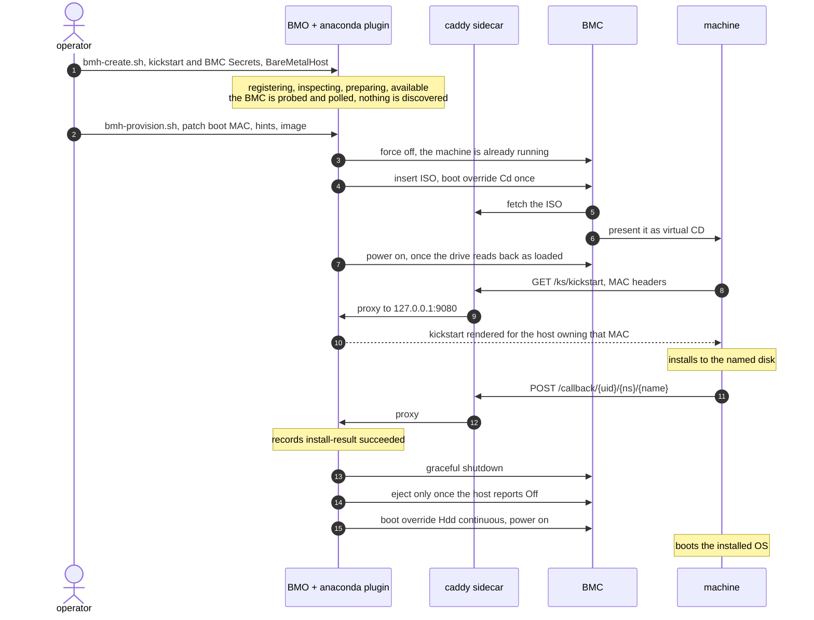

# Anaconda provisioner plugin (out-of-tree)

A BMO `-buildmode=plugin` `.so`. Boots an anaconda ISO as virtual media over
Redfish, serves the kickstart on `/ks/`, waits for `/callback/`. No Ironic.

Nothing discovers hardware and only `live-iso` deploys. RAID, servicing and BMC
event subscriptions are refused, cleaning and firmware settings are ignored.

```sh
make image                              # operator image with the plugin layered in
make compile-check                      # compile only, not loadable
kubectl apply -f deploy/anaconda.yaml   # operator, caddy, ISO builder
deploy/bmh-create.sh                    # create one host, idle at available
deploy/bmh-provision.sh                 # patch in MAC, disk and image, then watch
deploy/bmh-delete.sh                    # remove the host and everything with it
hack/retarget-bmo.sh <ref> [repo-url]   # repin BMO, rewrites go.mod, go.sum, Dockerfile, Makefile, deploy
```

## Demo

Needs:

- [flux](https://fluxcd.io), it installs BMO.
- [cert-manager](https://cert-manager.io) for the webhook cert. Without it no
  BareMetalHost can be created, the webhook is `failurePolicy: Fail`.
- One amd64 node on `172.17.1.10`, `hostNetwork`, ports 8080, 9443, 8069, 9440
  and 9080 on loopback. The caddy sidecar and the ISO builder Job share
  `hostPath /var/lib/metal3-shared`.
  Another address means editing `ANACONDA_BASE_URL`, the Job's `KS_URL` and
  `BASE_URL` in `bmh-env.sh` together, and rebuilding the ISO that bakes it in.
- A Redfish BMC doing virtual media and boot override. The BMC fetches the ISO
  itself, and the machine reaches the node on 8080.



## BareMetalHost

| Field | Value |
|---|---|
| `spec.bmc.address` | `redfish-virtualmedia://host[/redfish/v1/Systems/<id>]`, `+http` or `+https` to fix the scheme |
| `spec.bootMACAddress` | The only thing `/ks/` matches on, so provisioning refuses without it. BMO's webhook makes it immutable once set |
| `spec.image.format` | `live-iso` |
| `spec.preprovisioningNetworkDataName` | Secret holding the kickstart under key `value` |
| `spec.rootDeviceHints` | Required. The install disk, `deviceName`/`wwnWithExtension`/`wwn`/`serialNumber` in that order, nothing else is expressible |

Inspection ingests a `HardwareData` CR of the same name and namespace if one
exists, else records the host name alone. Inventory comes from outside or not at
all, so `bmh-create.sh` withholds the MAC, the hints and the image, and
`bmh-provision.sh` patches all three in.

## Kickstart

A Go template over `.Name`, `.Namespace`, `.UID`, `.BootMAC`, `.CallbackURL` and
`.InstallDisk`, the last rendered from `spec.rootDeviceHints`. No MAC headers, a
MAC no host claims, a missing Secret, or an `.InstallDisk` the template asks for
and the hints do not give, all serve a compiled in fallback that powers the
machine off rather than a half rendered kickstart. Naming a field that does not
exist is a 500, which leaves anaconda at a prompt.

POST `.CallbackURL` empty or `{"status":"installed"}` to finish (`ok`, `success`
and `complete` also pass). Any other status fails the host with its `message`,
silence fails it after `ANACONDA_INSTALL_TIMEOUT`. The verdict lands on
`anaconda.metal3.io/install-result` and `…/install-message`.

## Configuration

| Variable | Default | Meaning |
|---|---|---|
| `ANACONDA_LISTEN_ADDR` | unset | Starts the listener, unset disables `/ks` and `/callback` |
| `ANACONDA_BASE_URL` | derived from `ANACONDA_LISTEN_ADDR` | Base for `.CallbackURL`. A wildcard or loopback bind derives an address the machine cannot reach, so set it unless the listener is already routable |
| `ANACONDA_INSTALL_TIMEOUT` | `60m` | One budget from the ISO going in. No callback by then fails the host, a host that will not shut down afterwards is cut power |

## Security

The provisioning network is assumed to be secure. Everything on it is plain
HTTP, and a machine is trusted to say which host it is.
